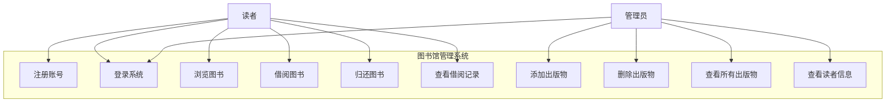
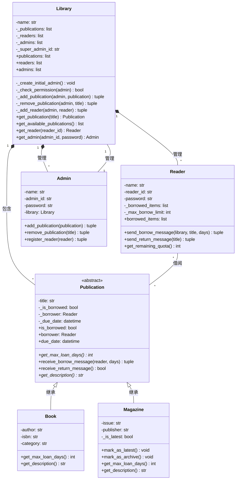
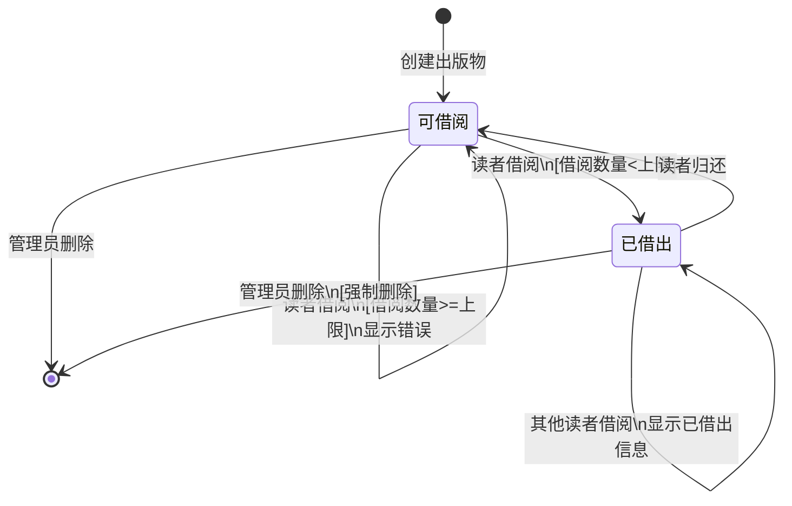
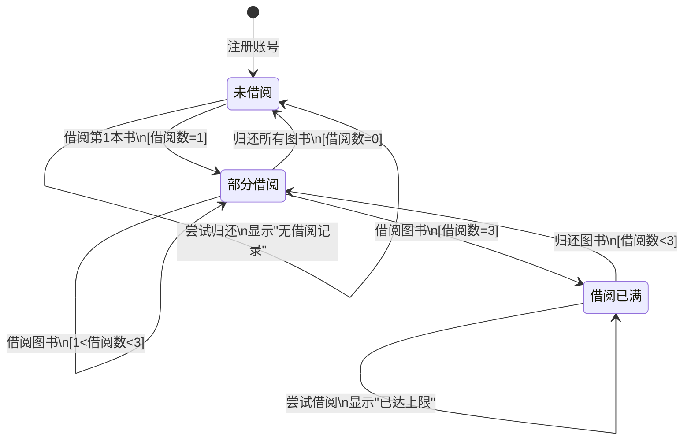

# 图书馆管理系统：面向对象分析、设计与实现

## 一、面向对象分析

### 1.1 需求阐述

本图书馆管理系统旨在实现图书馆日常运营的数字化管理，主要服务于两类用户：管理员和读者。

**系统目标：**
- 实现图书和期刊的统一管理
- 提供便捷的借阅和归还服务
- 支持读者自助注册和借阅操作
- 提供管理员对资源和用户的管理功能

**功能需求：**

1. **读者功能需求**
   - 用户注册：读者可自主注册账号
   - 用户登录：通过读者ID和密码登录系统
   - 浏览图书：查看所有可借阅的出版物
   - 借阅图书：借阅图书或期刊（最多3本）
   - 归还图书：归还已借阅的出版物
   - 查看借阅记录：查看当前借阅的图书及到期时间

2. **管理员功能需求**
   - 管理员登录：通过管理员账号登录
   - 添加出版物：添加新的图书或期刊
   - 删除出版物：移除图书馆中的出版物
   - 查看所有出版物：查看图书馆所有资源
   - 查看读者信息：查看所有注册读者

3. **系统功能需求**
   - 借阅规则管理：图书14天，最新期刊7天，过刊14天
   - 借阅限制：每位读者最多借阅3本
   - 数据持久化：系统数据保存到JSON文件
   - 权限控制：区分管理员和读者权限

**非功能需求：**
- 易用性：界面简洁友好，操作流程清晰
- 可靠性：数据持久化保证数据不丢失
- 可维护性：采用面向对象设计，代码结构清晰
- 可扩展性：支持添加新的出版物类型

### 1.2 功能模型：用例图

**核心用例详细描述：**

#### 用例1：借阅图书

**用例名称：** 借阅图书

**参与者：** 读者

**前置条件：** 
- 读者已登录系统
- 读者当前借阅数量未达到上限（3本）
- 目标图书处于可借状态

**主要流程：**
1. 读者在可借阅图书列表中浏览图书
2. 读者选择要借阅的图书，点击"借阅"按钮
3. 系统检查读者借阅数量是否达到上限
4. 系统检查图书是否可借
5. 系统记录借阅信息（借阅者、借阅时间、到期时间）
6. 系统更新图书状态为"已借出"
7. 系统将图书添加到读者的借阅列表
8. 系统显示借阅成功消息和归还日期

**后置条件：**
- 图书状态变为"已借出"
- 读者借阅列表增加该图书
- 系统记录借阅时间和到期时间

**异常流程：**
- 3a. 读者借阅数量已达上限：系统提示"已达到最大借阅数量（3本）"
- 4a. 图书已被借出：系统提示"书已被XXX借出，预计YYYY-MM-DD归还"

#### 用例2：添加出版物

**用例名称：** 添加出版物

**参与者：** 管理员

**前置条件：**
- 管理员已登录系统
- 管理员具有添加出版物的权限

**主要流程：**
1. 管理员进入管理员仪表板
2. 管理员在"添加图书"表单中填写图书信息（书名、作者、ISBN、分类）
3. 管理员点击"添加图书"按钮
4. 系统验证管理员权限
5. 系统检查图书是否已存在（通过书名）
6. 系统创建新的图书对象
7. 系统将图书添加到图书馆的出版物列表
8. 系统保存数据到JSON文件
9. 系统显示"添加成功"消息
10. 系统刷新出版物列表

**后置条件：**
- 新图书被添加到系统中
- 图书在出版物列表中可见
- 数据被持久化保存

**异常流程：**
- 4a. 管理员权限不足：系统提示"权限不足"
- 5a. 图书已存在：系统提示"出版物已存在"

#### 用例3：归还图书

**用例名称：** 归还图书

**参与者：** 读者

**前置条件：**
- 读者已登录系统
- 读者当前有借阅的图书

**主要流程：**
1. 读者在"我的借阅"列表中查看已借图书
2. 读者选择要归还的图书，点击"归还"按钮
3. 系统验证该图书是否在读者的借阅列表中
4. 系统更新图书状态为"可借"
5. 系统清除图书的借阅信息（借阅者、到期时间）
6. 系统从读者借阅列表中移除该图书
7. 系统保存数据
8. 系统显示"成功归还《XXX》"消息

**后置条件：**
- 图书状态变为"可借"
- 图书从读者借阅列表中移除
- 图书可被其他读者借阅

**异常流程：**
- 3a. 图书不在借阅列表中：系统提示"没有借阅《XXX》"

### 1.3 对象模型：类图

**类的职责说明：**

1. **Publication（出版物抽象类）**
   - 职责：定义所有出版物的通用属性和行为
   - 管理借阅状态（是否被借出、借阅者、到期时间）
   - 处理借阅和归还消息
   - 定义抽象方法供子类实现（最大借阅天数、描述信息）

2. **Book（图书类）**
   - 职责：表示图书类型的出版物
   - 存储图书特有信息（作者、ISBN、分类）
   - 实现图书的借阅规则（14天借阅期）
   - 提供图书的描述信息

3. **Magazine（期刊类）**
   - 职责：表示期刊类型的出版物
   - 存储期刊特有信息（期号、出版商、是否最新期刊）
   - 实现期刊的借阅规则（最新期刊7天，过刊14天）
   - 支持期刊状态管理（最新/过刊）

4. **Library（图书馆类）**
   - 职责：系统的核心管理类
   - 管理所有出版物、读者和管理员
   - 提供权限控制机制
   - 提供查询功能（查找出版物、读者、管理员）
   - 协调各个对象之间的交互

5. **Reader（读者类）**
   - 职责：表示系统用户（读者）
   - 管理个人借阅记录
   - 发送借阅和归还请求
   - 维护借阅限额（最多3本）

6. **Admin（管理员类）**
   - 职责：表示系统管理员
   - 执行管理操作（添加/删除出版物、注册读者）
   - 作为Library和具体操作之间的中介
   - 提供权限验证

**类之间的关系：**

1. **继承关系**
   - Book和Magazine继承自Publication
   - 实现多态性，不同类型出版物有不同的借阅规则

2. **组合关系**
   - Library包含多个Publication、Reader和Admin
   - Library负责这些对象的生命周期管理

3. **关联关系**
   - Reader与Publication之间是多对多关联（借阅关系）
   - Admin与Library之间是一对一关联（管理关系）

4. **依赖关系**
   - Reader依赖Library进行借阅操作
   - Admin依赖Library执行管理操作

### 1.4 动态模型：状态图

#### 状态图1：出版物状态图

**状态说明：**

1. **可借阅状态**
   - 初始状态：出版物被添加到系统后的默认状态
   - 特征：_is_borrowed = False, _borrower = None, _due_date = None
   - 可执行操作：读者可以借阅、管理员可以删除

2. **已借出状态**
   - 特征：_is_borrowed = True, _borrower = 具体读者对象, _due_date = 归还日期
   - 可执行操作：当前借阅者可以归还、其他读者查看借阅信息

**状态转换触发条件：**

| 转换 | 触发事件 | 前置条件 | 后置操作 |
|------|---------|---------|---------|
| 可借阅 → 已借出 | receive_borrow_message() | 读者借阅数<3 | 设置借阅者、计算到期时间 |
| 已借出 → 可借阅 | receive_return_message() | 借阅者归还 | 清除借阅信息 |
| 任意状态 → 删除 | 管理员删除操作 | 管理员权限 | 从系统移除 |

#### 状态图2：读者借阅状态图

**状态说明：**

1. **未借阅状态**
   - 初始状态：读者注册后的默认状态
   - 特征：_borrowed_items = []（空列表）
   - 可执行操作：可以借阅图书

2. **部分借阅状态**
   - 特征：0 < len(_borrowed_items) < 3
   - 可执行操作：可以继续借阅或归还图书

3. **借阅已满状态**
   - 特征：len(_borrowed_items) = 3
   - 可执行操作：只能归还图书，不能借阅新书

**状态转换触发条件：**

| 转换 | 触发事件 | 前置条件 | 后置操作 |
|------|---------|---------|---------|
| 未借阅 → 部分借阅 | send_borrow_message() | 借阅成功 | 借阅数+1 |
| 部分借阅 → 借阅已满 | send_borrow_message() | 借阅数达到2，再借1本 | 借阅数=3 |
| 借阅已满 → 部分借阅 | send_return_message() | 归还成功 | 借阅数-1 |
| 部分借阅 → 未借阅 | send_return_message() | 归还最后一本 | 借阅数=0 |

